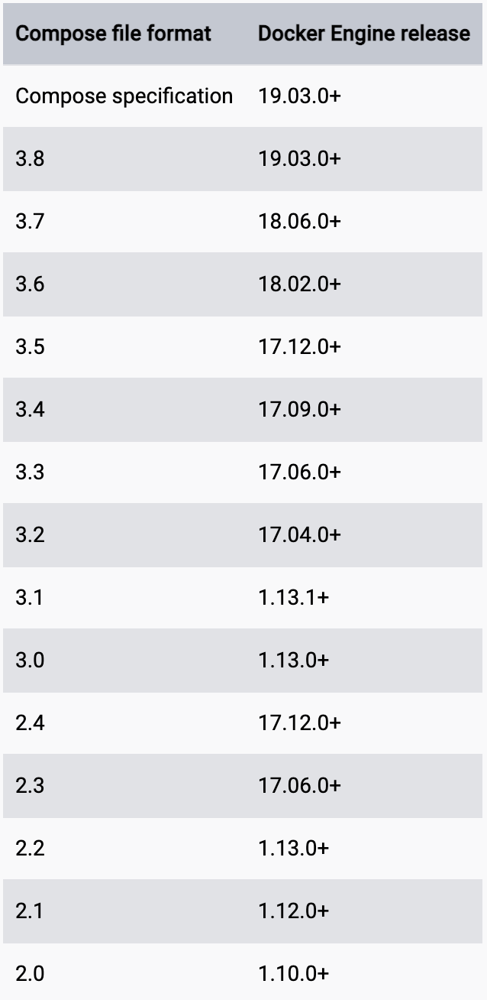
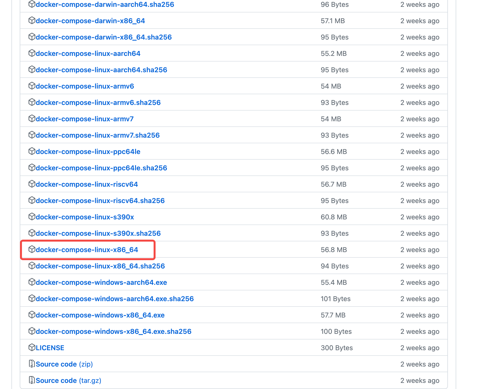

## 1、前置条件
先安装Docker Engine
## 2、Compose和Docker兼容性矩阵

## 3、下载docker-compose
地址：
```https://github.com/docker/compose/releases```

## 4、安装docker-compose
1、重命名下载文件 改成docker-compose
2、移动文件
``` sudo mv docker-compose /usr/local/bin/docker-compose ```
3、进入 /usr/local/bin目录下赋予docker-compose可执行权限
```chomd 777 docker-compose```
## 5、验证是否安装成功
```docker-compose -v ```